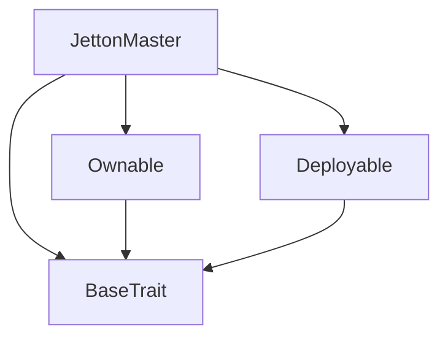
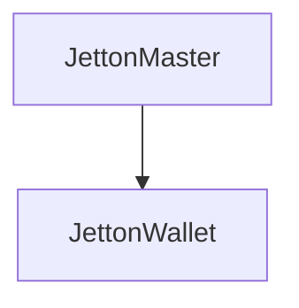

# Tact compilation report
Contract: JettonMaster
BoC Size: 2487 bytes

## Structures (Structs and Messages)
Total structures: 26

### DataSize
TL-B: `_ cells:int257 bits:int257 refs:int257 = DataSize`
Signature: `DataSize{cells:int257,bits:int257,refs:int257}`

### SignedBundle
TL-B: `_ signature:fixed_bytes64 signedData:remainder<slice> = SignedBundle`
Signature: `SignedBundle{signature:fixed_bytes64,signedData:remainder<slice>}`

### StateInit
TL-B: `_ code:^cell data:^cell = StateInit`
Signature: `StateInit{code:^cell,data:^cell}`

### Context
TL-B: `_ bounceable:bool sender:address value:int257 raw:^slice = Context`
Signature: `Context{bounceable:bool,sender:address,value:int257,raw:^slice}`

### SendParameters
TL-B: `_ mode:int257 body:Maybe ^cell code:Maybe ^cell data:Maybe ^cell value:int257 to:address bounce:bool = SendParameters`
Signature: `SendParameters{mode:int257,body:Maybe ^cell,code:Maybe ^cell,data:Maybe ^cell,value:int257,to:address,bounce:bool}`

### MessageParameters
TL-B: `_ mode:int257 body:Maybe ^cell value:int257 to:address bounce:bool = MessageParameters`
Signature: `MessageParameters{mode:int257,body:Maybe ^cell,value:int257,to:address,bounce:bool}`

### DeployParameters
TL-B: `_ mode:int257 body:Maybe ^cell value:int257 bounce:bool init:StateInit{code:^cell,data:^cell} = DeployParameters`
Signature: `DeployParameters{mode:int257,body:Maybe ^cell,value:int257,bounce:bool,init:StateInit{code:^cell,data:^cell}}`

### StdAddress
TL-B: `_ workchain:int8 address:uint256 = StdAddress`
Signature: `StdAddress{workchain:int8,address:uint256}`

### VarAddress
TL-B: `_ workchain:int32 address:^slice = VarAddress`
Signature: `VarAddress{workchain:int32,address:^slice}`

### BasechainAddress
TL-B: `_ hash:Maybe int257 = BasechainAddress`
Signature: `BasechainAddress{hash:Maybe int257}`

### Deploy
TL-B: `deploy#946a98b6 queryId:uint64 = Deploy`
Signature: `Deploy{queryId:uint64}`

### DeployOk
TL-B: `deploy_ok#aff90f57 queryId:uint64 = DeployOk`
Signature: `DeployOk{queryId:uint64}`

### FactoryDeploy
TL-B: `factory_deploy#6d0ff13b queryId:uint64 cashback:address = FactoryDeploy`
Signature: `FactoryDeploy{queryId:uint64,cashback:address}`

### ChangeOwner
TL-B: `change_owner#819dbe99 queryId:uint64 newOwner:address = ChangeOwner`
Signature: `ChangeOwner{queryId:uint64,newOwner:address}`

### ChangeOwnerOk
TL-B: `change_owner_ok#327b2b4a queryId:uint64 newOwner:address = ChangeOwnerOk`
Signature: `ChangeOwnerOk{queryId:uint64,newOwner:address}`

### DeFiParams
TL-B: `_ apr:int257 total_locked:int257 last_update:int257 synapse_depth:int257 liquidity_ratio:int257 ai_risk_score:int257 = DeFiParams`
Signature: `DeFiParams{apr:int257,total_locked:int257,last_update:int257,synapse_depth:int257,liquidity_ratio:int257,ai_risk_score:int257}`

### NeuralState
TL-B: `_ history_hash:int257 evolution_cycles:int257 threat_level:int257 policy_weight:int257 last_tx_time:int257 mutation_seed:int257 memory_bank:int257 = NeuralState`
Signature: `NeuralState{history_hash:int257,evolution_cycles:int257,threat_level:int257,policy_weight:int257,last_tx_time:int257,mutation_seed:int257,memory_bank:int257}`

### WalletData
TL-B: `_ balance:int257 owner:address master:address walletCode:^cell allowance:int257 = WalletData`
Signature: `WalletData{balance:int257,owner:address,master:address,walletCode:^cell,allowance:int257}`

### TokenTransfer
TL-B: `token_transfer#f8c7a650 query_id:uint64 amount:coins destination:address response_destination:address custom_payload:Maybe ^cell forward_ton_amount:coins forward_payload:remainder<slice> = TokenTransfer`
Signature: `TokenTransfer{query_id:uint64,amount:coins,destination:address,response_destination:address,custom_payload:Maybe ^cell,forward_ton_amount:coins,forward_payload:remainder<slice>}`

### TokenTransferInternal
TL-B: `token_transfer_internal#178d4519 query_id:uint64 amount:coins from:address response_destination:address forward_ton_amount:coins forward_payload:remainder<slice> = TokenTransferInternal`
Signature: `TokenTransferInternal{query_id:uint64,amount:coins,from:address,response_destination:address,forward_ton_amount:coins,forward_payload:remainder<slice>}`

### NeuralCommand
TL-B: `neural_command#a30668a0 market_entropy_adj:int257 ai_bias_adjustment:int257 emergency_freeze:bool = NeuralCommand`
Signature: `NeuralCommand{market_entropy_adj:int257,ai_bias_adjustment:int257,emergency_freeze:bool}`

### CognitiveFeedback
TL-B: `cognitive_feedback#c96ef3f2 strategy_shift:int257 confidence_level:int257 = CognitiveFeedback`
Signature: `CognitiveFeedback{strategy_shift:int257,confidence_level:int257}`

### Stake
TL-B: `stake#bef0e904 amount:coins = Stake`
Signature: `Stake{amount:coins}`

### Unstake
TL-B: `unstake#ff633be1 amount:coins = Unstake`
Signature: `Unstake{amount:coins}`

### JettonMaster$Data
TL-B: `_ owner:address jetton_content:^cell total_supply:coins total_staked:coins reserve_fund:coins defi:DeFiParams{apr:int257,total_locked:int257,last_update:int257,synapse_depth:int257,liquidity_ratio:int257,ai_risk_score:int257} market_entropy:int257 ai_bias:int257 neural:NeuralState{history_hash:int257,evolution_cycles:int257,threat_level:int257,policy_weight:int257,last_tx_time:int257,mutation_seed:int257,memory_bank:int257} is_frozen:bool = JettonMaster`
Signature: `JettonMaster{owner:address,jetton_content:^cell,total_supply:coins,total_staked:coins,reserve_fund:coins,defi:DeFiParams{apr:int257,total_locked:int257,last_update:int257,synapse_depth:int257,liquidity_ratio:int257,ai_risk_score:int257},market_entropy:int257,ai_bias:int257,neural:NeuralState{history_hash:int257,evolution_cycles:int257,threat_level:int257,policy_weight:int257,last_tx_time:int257,mutation_seed:int257,memory_bank:int257},is_frozen:bool}`

### JettonWallet$Data
TL-B: `_ balance:coins owner:address master:address last_interaction:int257 = JettonWallet`
Signature: `JettonWallet{balance:coins,owner:address,master:address,last_interaction:int257}`

## Get methods
Total get methods: 4

## get_vital_signs
No arguments

## get_neural_profile
No arguments

## get_wallet_address
Argument: owner_address

## owner
No arguments

## Exit codes
* 2: Stack underflow
* 3: Stack overflow
* 4: Integer overflow
* 5: Integer out of expected range
* 6: Invalid opcode
* 7: Type check error
* 8: Cell overflow
* 9: Cell underflow
* 10: Dictionary error
* 11: 'Unknown' error
* 12: Fatal error
* 13: Out of gas error
* 14: Virtualization error
* 32: Action list is invalid
* 33: Action list is too long
* 34: Action is invalid or not supported
* 35: Invalid source address in outbound message
* 36: Invalid destination address in outbound message
* 37: Not enough Toncoin
* 38: Not enough extra currencies
* 39: Outbound message does not fit into a cell after rewriting
* 40: Cannot process a message
* 41: Library reference is null
* 42: Library change action error
* 43: Exceeded maximum number of cells in the library or the maximum depth of the Merkle tree
* 50: Account state size exceeded limits
* 128: Null reference exception
* 129: Invalid serialization prefix
* 130: Invalid incoming message
* 131: Constraints error
* 132: Access denied
* 133: Contract stopped
* 134: Invalid argument
* 135: Code of a contract was not found
* 136: Invalid standard address
* 138: Not a basechain address
* 10237: Min 0.5 TON
* 31617: AI Brain: Hibernation Mode
* 49469: Access denied
* 51754: Insufficient funds
* 53619: AI Intuition: Liquidity locked for safety

## Trait inheritance diagram

## Contract dependency diagram

